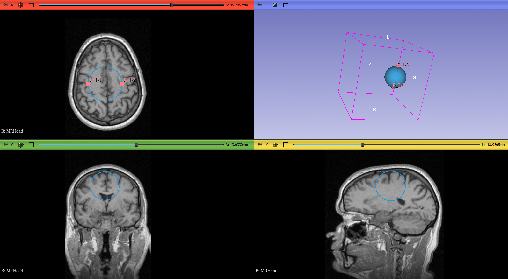

# 📦 MyFirstExtension

A simple 3D Slicer extension to demonstrate how to create custom scripted modules using Python.
Developed as part of learning and experimentation with Slicer modules and logic.

---

# 🧩 Modules
## MyFirstModule
This module is a basic example automatically generated by the extension template. It serves as a starting point for future developments. It does not contain complex logic or processing operations.

## SphereModule
This module allows you to generate a 3D sphere from two fiducial points placed in the scene.

- 📌 Input: `vtkMRMLMarkupsFiducialNode` with two points.
- 📦 Output: `vtkMRMLModelNode` representing the created sphere.
- ⚙️ Options: `Image Threshold` for opacity of the sphere and `Auto Update` to automatically updates the sphere.
- 📍 It also calculates the center of mass of the defined points.

---


# 🚀 How to Use
### 1️⃣ Clone the repository
```bash
  git clone https://github.com/Santiramoli/SlicerTutorial.git
```

### 2️⃣ Launch Slicer and open Extension Wizard

1. Open 3D Slicer.
2. Go to View → Extension Wizard.
3. In the Extension Wizard panel:
    - Click **"Select Extension Source Directory"**
    - Choose the path to your cloned folder: `SlicerTutorial/MyFirstExtension`

### 3️⃣ Run the module
1. In the Module Finder, search for `MyFirstModule` or `SphereModule` and open.

### 4️⃣ Use the SphereModule
1. Add two Fiducial points in the 3D scene (via the "Markups" module).
2. In SphereModule:
    - Select the input fiducial node.
    - Set the output model (a new one will be created if needed).
    - Adjust the opacity if desired.
3. Click Apply → a sphere will be generated between the two points.

---

# 🖼 Example Result


